# 1.图片演示
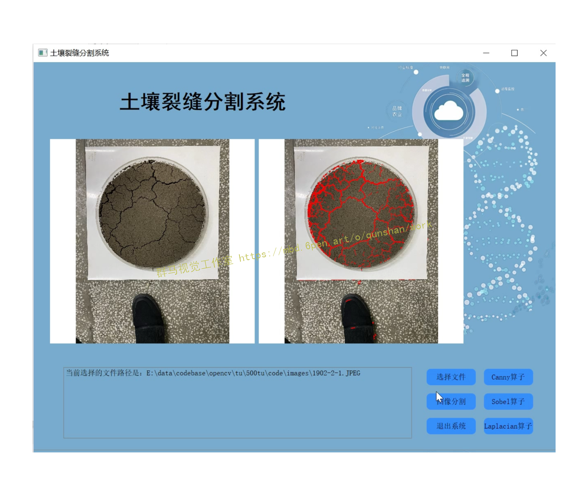

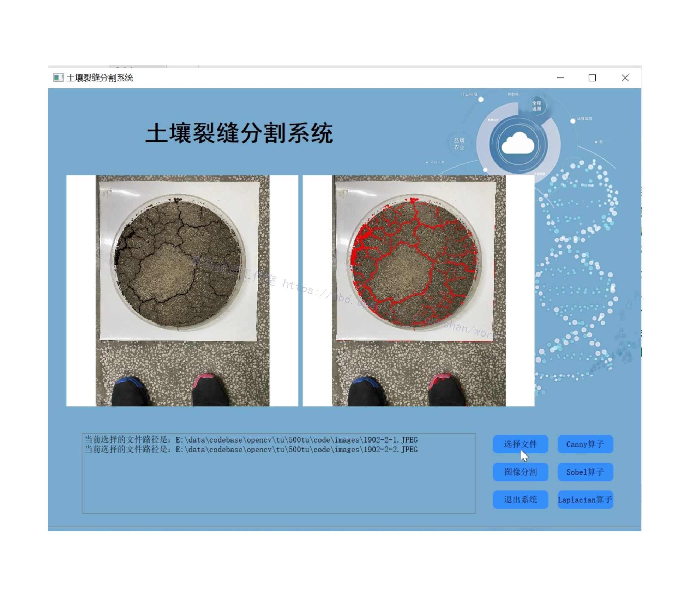


# 2.视频演示
[Python基于OpenCV的土壤裂缝分割系统[源码＆部署教程]](https://www.bilibili.com/video/BV1TP41157m6?spm_id_from=333.999.0.0&vd_source=bc9aec86d164b67a7004b996143742dc)

# 3.项目背景

在一幅图像中包括的内容有很多，除了目标物体之外，还有背景信息以及各类噪声信息。那么要想能够从多种内容的数字图像当中直接提取出我们所需要的目标物体，就需要加强目标的图像特征，削弱干扰物的图像特征。图像分割中的二值化分割就能实现如上的功能。
图像二值化分割就是将图像上的像素点的灰度值根据某种或某些算法设置为0或255，也就是将整个图像呈现出明显的黑白效果。将采集的图像信息灰度化之后仍不能较为清晰的识别裂缝信息，采用图像二值化分割可以明显的反映出裂缝信息与背景信息，十分直观的识别出裂缝。常用的二值化方法有全局二值化和局部自适应二值化。
[该博客提出以下方案](https://afdian.net/item?plan_id=1b93b5aa62f911edb20352540025c377)
(1)全局二值化
最为常见的二值化分割方法是全局二值化分割。具体实现原理是设置一个全局阈值T,用该阈值T将图像中的像素数据信息分成两个部分，即像素值大于T的像素群和像素值小于T的像素群。例如，我们可以将像素值大于T的像素群中的像素设定为白色(或者为黑色)，像素值小于T的像素群中的像素设定为黑色(或者为白色)。
选择合适的阈值将裂缝信息与背景信息及干扰物信息有效地进行分割。
但实际操作中由于受光线的影响，采集图像的明暗难以掌握，很难选择统的阈值进行分割。

(2)局部自适应二值化
为了改善全局二值化的缺陷，局部二值化方法应运而生。
局部二值化方法,就是根据某些预先指定的规则，将整幅图像按照条件划分为若干个窗口,然后将这些窗口中的每一个窗口中的图像的每一个像素点，根据其像素值使用同一个的阈值T将该窗口内的图像的像素划分为两个部分，从而进行二值化处理。
当然，局部二值化也有其自身的不足，这个不足就是需要对阈值T的取值进行预先的选定。然而，这个阈值的选定过程是没有任何理论支持的，以往的学看的一般做法为仅仅取该窗口中像素点的像素值的平局值，或者是根据某些实际实验中得出阈值T。


# 4.Canny边缘检测
[参考该博客提供了提取图像边缘的函数canny](https://mbd.pub/o/bread/Y5Wblp9t)。其算法思想如下：
1. 使用高斯模糊，去除噪音点（cv2.GaussianBlur）
2. 灰度转换（cv2.cvtColor）
3. 使用sobel算子，计算出每个点的梯度大小和梯度方向
4. 使用非极大值抑制(只有最大的保留)，消除边缘检测带来的杂散效应
5. 应用双阈值，来确定真实和潜在的边缘
6. 通过抑制弱边缘来完成最终的边缘检测

高斯滤波
```
gaussian = cv2.GaussianBlur(color_img, (gaussian_ksize,gaussian_ksize), gaussian_sigmax)
```
color_img 输入图片
gaussian_ksize 高斯核大小，可以为方形矩阵，也可以为矩形
gaussian_sigmax X方向上的高斯核标准偏差

Canny边缘检测器是一种被广泛使用的算法，并被认为是边缘检测最优的算法，该方法使用了比高斯差分算法更复杂的技巧，如多向灰度梯度和滞后阈值化

步骤
平滑图像：使用高斯滤波器与图像进行卷积，平滑图像，以减少边缘检测器上明显的噪声影响

计算图像的梯度和方向：图像中的边缘可以指向各个方向，这里计算图像的梯度，并将梯度分类为垂直、水平和斜对角。

非最大值抑制：利用上一步计算出来的梯度方向，检测某一像素在梯度的正方向和负方向上是否是局部最大值，如果是，则该像素点保留为边缘点，否则该像素点将被抑制。

双阈值算法检测和连接边缘：仍然存在由于噪声和颜色变化引起的一些边缘像素。为了解决这些杂散响应，必须用弱梯度值过滤边缘像素，并保留具有高梯度值的边缘像素，可以通过选择高低阈值来实现
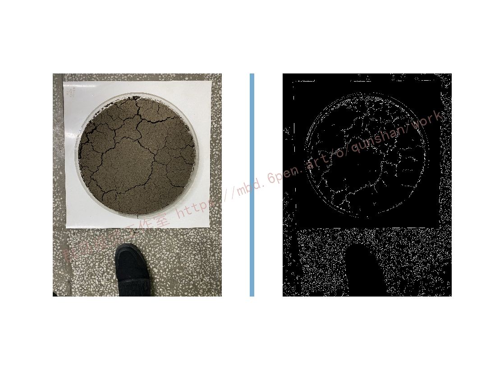

# 5.Sobel边缘检测
**Sobel**算子：是离散微分算子（discrete differentiation operator），用来计算图像灰度的近似梯度，梯度越大越有可能是边缘。

Soble算子的功能集合了高斯平滑和微分求导，又被称为一阶微分算子，求导算子，在水平和垂直两个方向上求导，得到的是图像在X方法与Y方向梯度图像。

缺点：比较敏感，容易受影响，要通过高斯模糊（平滑）来降噪。

算子是通过权重不同来扩大差异。

**（1）梯度计算**：（在两个方向求导，假设被作用图像为 I）

水平变化: 将 I 与一个奇数大小的内核 Gx进行卷积。比如，当内核大小为3时, Gx的计算结果为:

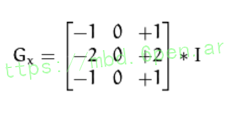


垂直变化: 将 I 与一个奇数大小的内核 Gy进行卷积。比如，当内核大小为3时, Gy的计算结果为:

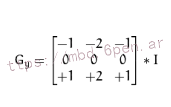


在图像的每一像素上，结合以上两个结果求出近似梯度：

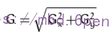


有时也用下面更简单公式代替，计算速度快：（最终图像梯度）。

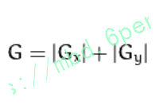


**（2）Scharr**：当内核大小为3时, 以上Sobel内核可能产生比较明显的误差(毕竟，Sobel算子只是求取了导数的近似值)。 为解决这一问题，OpenCV提供了 Scharr 函数，但该函数仅作用于大小为3的内核。该函数的运算与Sobel函数一样快，但结果却更加精确，不怕干扰，其内核为:

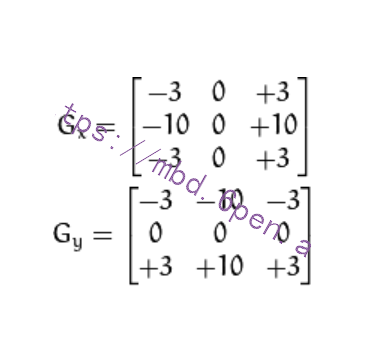


**（3）Sobel/Scharr提取边缘（求导）步骤：**

1）高斯模糊平滑降噪：

GaussianBlur( src, dst, Size(3,3), 0, 0, BORDER_DEFAULT );

2）转灰度：

cvtColor( src, gray, COLOR_RGB2GRAY );

3）求X和Y方向的梯度（求导）：

Sobel(gray_src, xgrad, CV_16S, 1, 0, 3);

Sobel(gray_src, ygrad, CV_16S, 0, 1, 3);

Scharr(gray_src, xgrad, CV_16S, 1, 0);

Scharr(gray_src, ygrad, CV_16S, 0, 1);

4）像素取绝对值：

convertScaleAbs(A, B); //计算图像A的像素绝对值，输出到图像B

[图片上传失败...(image-4ea8ad-1662621323461)]

5）相加X和Y，得到综合梯度，称为振幅图像：

addWeighted( A, 0.5,B, 0.5, 0, AB); //混合权重相加，效果较差
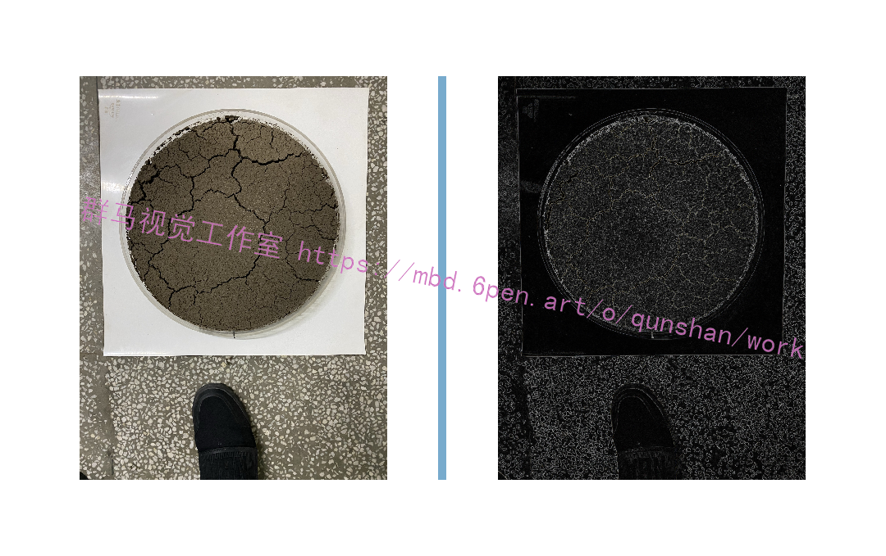


# 6.Laplacian算子边缘检测
Laplacian算子利用二阶导数信息，具有各向同性，即与坐标轴方向无关，坐标轴旋转后梯度结果不变。使得图像经过二阶微分后，在边缘处产生一个陡峭的零交叉点，根据这个对零交叉点判断边缘。其4邻域系统和8邻域系统的Laplacian算子的模板分别如图所示。
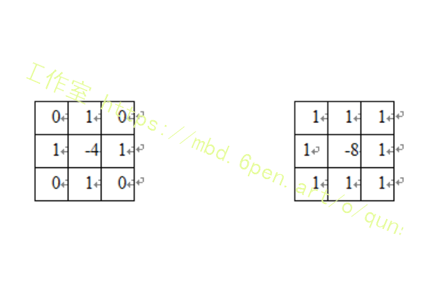

 

 通常使用的拉普拉斯算子3×3模板如图所示：

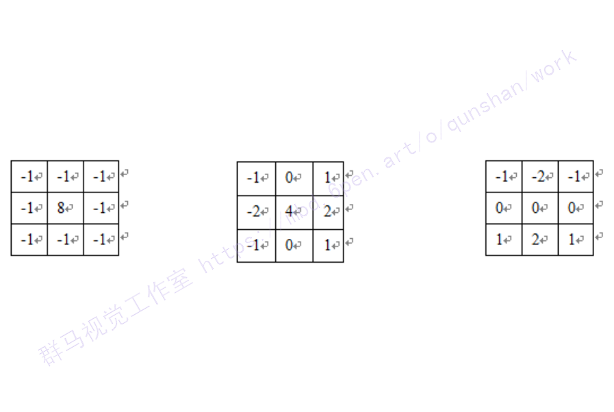

Laplacian算子对噪声比较敏感，Laplacian算子有一个缺点是它对图像中的某些边缘产生双重响应。所以图像一般先经过平滑处理，通常把Laplacian算子和平滑算子结合起来生成一个新的模板。

# 7.代码实现
```
I=imread('lena.bmp');
I=im2double(I);
%figure;
%imshow(I);title('org img');
 
[height width R]=size(I);
for i=2:height-1
    for j=2:width-1
       L(i,j)=4*I(i,j)-I(i-1,j)-I(i+1,j)-I(i,j-1)-I(i,j+1);
    
    end
end
%figure;
%imshow(L,[]);
 
%G(i,j)=0.3*L(i,j)+0.7*I(i,j);
%figure;
%imshow(G,[]);
 
for i=1:height-1
    for j=1:width-1
        if (L(i,j)<0.2)
            L(i,j)=1;
        else L(i,j)=0;
        end
    end
end
figure;
imshow(L,[]);
 ```
# 8.系统整合
下图[完整源码＆环境部署视频教程＆自定义UI界面](https://s.xiaocichang.com/s/8f88eb)

参考博客[《Python基于OpenCV的土壤裂缝分割系统\[源码＆部署教程\]》](https://mbd.pub/o/qunma/work)


# 9.参考文献
*   *[1]*[农田土壤表面干缩裂缝的随机分布统计特征](https://kns.cnki.net/kcms/detail/detail.aspx?filename=NYGU201316018&dbcode=CJFD&dbname=CJFD2013&v=P730Z7WqRMPrGwMKl1iLpbHAc_Ot9G2MuDK75vkFAY6xM81gUkCkudeYjjle8g_V)[J]. 张展羽,朱文渊,朱成立,王策,吴春辉,司涵.  农业工程学报. 2013(16)
*   *[2]*[牛肉大理石花纹图像特征信息提取及自动分级方法](https://kns.cnki.net/kcms/detail/detail.aspx?filename=NYGU201315036&dbcode=CJFD&dbname=CJFD2013&v=P730Z7WqRMMXfJvyDwFV6bCenjYAC-0X_xybNJdO5vrGW47TEnxrdd_Tq0Qcrqf4)[J]. 周彤,彭彦昆.  农业工程学报. 2013(15)
*   *[3]*[元谋干热河谷区退化坡地土壤裂缝形态发育的影响因子](https://kns.cnki.net/kcms/detail/detail.aspx?filename=NYGU201301016&dbcode=CJFD&dbname=CJFD2013&v=P730Z7WqRMO_Mu4EJZfQoOPzwSt8mfQN_DX11DNyKUEMRiK5DtgL1o-PLzP6DWIp)[J]. 熊东红,杨丹,李佳佳,苏正安,董一帆,翟娟.  农业工程学报. 2013(01)
*   *[4]*[影响黏性土表面干缩裂缝结构形态的因素及定量分析](https://kns.cnki.net/kcms/detail/detail.aspx?filename=SLXB200710007&dbcode=CJFD&dbname=CJFD2007&v=R3hiRNYBRlAOaHrRAfMaX6Bu7Auxjp-6pflPPMTYBaSZR5gU7f5DEfp4RCeexWK7)[J]. 唐朝生,施斌,刘春,王宝军.  水利学报. 2007(10)
*   *[5]*[考虑裂隙及雨水入渗影响的膨胀土边坡稳定性分析](https://kns.cnki.net/kcms/detail/detail.aspx?filename=YTGC200105018&dbcode=cjfd&dbname=cjfd2001&v=Bs1pNv2YVeQ6hGfCKmOD1X-0baQonX485Vl_go7bICNePYOkOSsdygx1hW139dxg)[J]. 姚海林,郑少河,陈守义.  岩土工程学报. 2001(05)


---
#### 如果您需要更详细的【源码和环境部署教程】，除了通过【系统整合】小节的链接获取之外，还可以通过邮箱以下途径获取:
#### 1.请先在GitHub上为该项目点赞（Star），编辑一封邮件，附上点赞的截图、项目的中文描述概述（About）以及您的用途需求，发送到我们的邮箱
#### sharecode@yeah.net
#### 2.我们收到邮件后会定期根据邮件的接收顺序将【完整源码和环境部署教程】发送到您的邮箱。
#### 【免责声明】本文来源于用户投稿，如果侵犯任何第三方的合法权益，可通过邮箱联系删除。